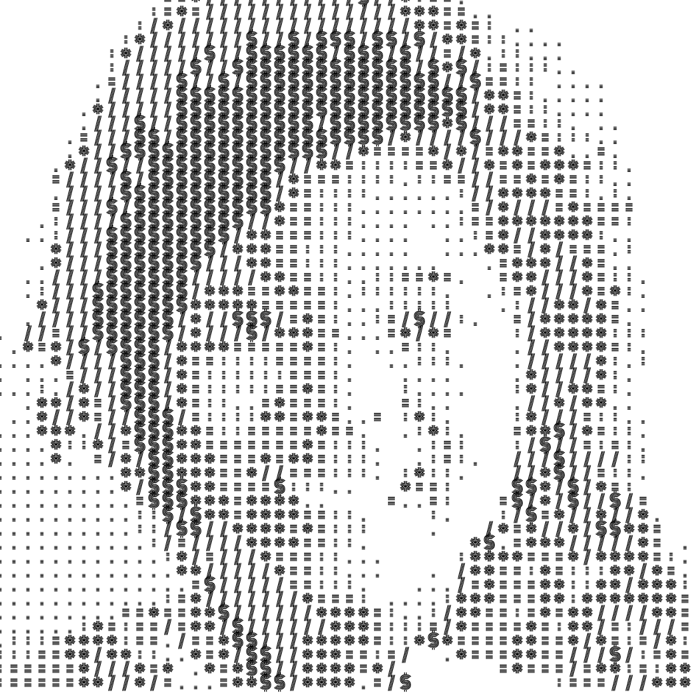
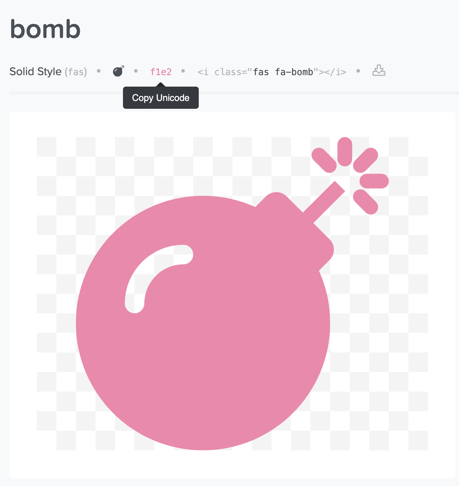

# p5js_image_alteration

This repo is a curiculum dedicated to the manipulation of images through their pixels with [p5.js](https://p5js.org/). This is a project taught at [l'école de design de Nantes](https://www.lecolededesign.com/) in graphic design. The curriculum is here detailed in french, but comments in each example are written in english.

L'objectif de ce repo est de découvrir les différentes techniques de manipulation d'images à travers l'analyse de leurs pixels avec [p5.js](https://p5js.org/). Les techniques décrites ici sont accessibles aux débutants il est cependant nécessaire de connaitre les bases de la programmation avec p5js dans un environnement de développement de votre choix c'est à dire par exemple d'avoir lu et intégrer les 3 premiers paragraphes de cette [ressource d'introduction](https://github.com/b2renger/Introduction_p5js) :

- [Comment travailler avec p5js](https://github.com/b2renger/Introduction_p5js#p5js_tools)
- [Les principes de base](https://github.com/b2renger/Introduction_p5js#bases)
- [Dessiner avec la souris](https://github.com/b2renger/Introduction_p5js#dessiner)

Les images que nous utiliserons pour ces exemples sont générés via un algorithme d'intelligence artificielle appelé **StyleGan2** disponible à travers le logiciel [runwayML](https://runwayml.com/).

 

Exemples de rendus : 

        

  


## Contenu


* [Squelette du code](#Squelette-de-code)
* [Charger une image](#Charger-une-image) - [**Démo**](https://b2renger.github.io/p5js_image_alteration/01_charger_et_afficher_une_image/)
* [Extraire les composantes de la couleur de chaque pixel](#Extraire-les-composantes-de-la-couleur-de-chaque-pixel)
    * [Première variante : des ellipse](#utiliser-des-ellipses) - [**Démo**](https://b2renger.github.io/p5js_image_alteration/02_acceder_aux_pixels_ellipses/)
    * [Deuxième variante : des lignes](#utiliser-des-lignes) - [**Démo**](https://b2renger.github.io/p5js_image_alteration/02_acceder_aux_pixels_lines/)
    * [Troisième variante : des lignes orientées](#utiliser-des-lignes-et-une-rotation) - [**Démo**](https://b2renger.github.io/p5js_image_alteration/02_acceder_aux_pixels_lines_rotation/)

* [Ajouter des controleurs](#ajouter-des-controleurs)
    * [Ajouter une option](#ajouter-une-option) - [**Démo**](https://b2renger.github.io/p5js_image_alteration/03_ajouter_des_parametres/)
    * [Ajouter plusieures options](#Utiliser-plusieures-options) - [**Démo**](https://b2renger.github.io/p5js_image_alteration/03_ajouter_des_parametres_multiples/)

* [Charger des polices et afficher du texte](#Charger-des-polices-et-afficher-du-texte)
    * [Exemple simple](#Exemple-simple) - [**Démo**](https://b2renger.github.io/p5js_image_alteration/04_afficher_du_texte/)
    * [Choix de police](#Choix-de-police) - [**Démo**](https://b2renger.github.io/p5js_image_alteration/04_afficher_du_texte_parametres/)
    * [Ascii art](#Ascii-art) - [**Démo**](https://b2renger.github.io/p5js_image_alteration/04_afficher_du_texte_parametres_ascii/)
    * [Texte complet](#Texte-complet) - [**Démo**](https://b2renger.github.io/p5js_image_alteration/04_afficher_du_texte_parametres_complet/)

* [Utiliser fontawesome](#Utiliser-fontawesome) - [**Démo**](https://b2renger.github.io/p5js_image_alteration/05_utiliser_fontawesome/)

* [Utiliser du noise](#Utiliser-du-noise) - [**Démo**](https://b2renger.github.io/p5js_image_alteration/06_utiliser_du_noise/)

* [Exporter](#Exporter)
    * [Exporter en PNG](#Exporter-en-PNG) - [**Démo**](https://b2renger.github.io/p5js_image_alteration/07_exporter_en_png/)
    * [Exporter en SVG](#Exporter-en-SVG) - [**Démo**](https://b2renger.github.io/p5js_image_alteration/07_exporter_en_svg/)
    * [Exporter plusieures couches svg](Exporter-plusieures-couches-svg) - [**Démo**](https://b2renger.github.io/p5js_image_alteration/07_exporter_plusieures_couches/)


## Squelette de code
Vous trouverez dans le dossier nommé **00_empty** le squelette de base du programme p5js que nous allons utiliser. Notez que ce squelette comporte une fonction **timestamp()** précodée qui nous permettra de générer une chaîne de caractère représentant la date au moment de son appel :

```js
function timestamp() {
    return year() + "-" + month() + "-" + day() + "-" + hour() + "h" + minute() + "m" + second() + "s"
}
```
Cette fonction nous sera utile au moment des exports afin de nous assurer de l'unicité des noms des fichiers que nous récupérerons.

Cet exemple vide contient aussi un fichier CSS permettant de centrer notre canvas dans notre page web, puisque nous allons travailler dans un format carré.

Le fichier **index.html** contient des liens vers les bibliothèques nécessaires pour la bonne éxécution des différents exemples, ces bibliothèques sont placées dans le dossier *libraries*. Et le dossier *assets* contient images et polices qui seront utilisées.

Afin de favoriser les exports (ultérieurement) nous allons prendre l'habitude dès les premiers exemples de réaliser tous les affichage dans une fonction dédiée apellée **myDrawing()** plutôt que de dessiner directement dans la fonction **draw()**.

[**home**](#Contenu)

## Charger une image

Notre premier exemple va nous permettre de découvrir les mécanismes de bases nécessaire à charger et afficher une image sans aucune manipulation supplémentaire pour l'instant.

Afin de charger une image nous allons utiliser la fonction [**loadImage()**](https://p5js.org/reference/#/p5/loadImage), dans la fonction preload de notre squelette de code, en indiquant le lien vers l'image que nous souhaitons utiliser - qui est donc située dans le dossier *assets*

Il faut au préalable créer une variable que nous nommerons *img* pour pouvoir stocker le résultat de l'appel de la fonction loadImage dans la mémoire de notre ordinateur afin d'avoir la possibilité d'y accéder par ce nom ultérieurement.

```js
let img

function preload() {
    img = loadImage("../assets/StyleGAN2_portrait.jpeg")
}
```

Il nous reste maintenant à afficher nos images en appelant les fonctions dédiées [**image()**](https://p5js.org/reference/#/p5/image) et [**imageMode()**](https://p5js.org/reference/#/p5/imageMode).

```js
function myDrawing() {
    imageMode(CENTER)
    image(img, width*0.5, height*0.5)
}
```

Dans la documentation de la fonction **loadImage()** il est mentionné qu'il est possible de passer un fonction dite **callback** en paramètre. 
De manière simplifiée, une fonction callback est une série d'instructions (de lignes de code) qui pourra executée une fois que l'action demandée a été effectuée.
Dans la fonction **loadImage()** on peut passer deux fonctions : une en cas de succès du chargement de l'image, une en cas d'échec. Il est donc possible d'éxecuter des choses en fonction du succès ou de l'échec de l'opération **loadImage()**.

En javascript on va donc passer une fonction qui n'a pas de nom que l'on appelle fonction **anonyme**.
En cas de succès on va afficher un message dans la console précisant que l'image a bien été chargée et on va redimensionner notre image. En cas d'échec nous allons juste afficher un message d'erreur.

```js
function preload() {
    // we load the image in the preload function - be sure to use a server of some kind
    img = loadImage("../assets/StyleGAN2_portrait.jpeg",
            // success callback passed to load image
            function(){
                console.log("image loaded")
                img.resize(100,100)
            },
            // error callback passed to load image
            function(){
                console.log("failed to load image - try checking the path of your image")
            }
    )
}
```
Nous allons systèmatiquement redimensionner nos images à de petites tailles. Car nous allons créer des opérations sur chaque pixel de l'image, une image de 100px * 100px représente 10000 opérations à réaliser et ce à chaque affichage, cela fait déjà beaucoup ! Il est donc préférable de travailler sur des résolutions d'images plus faibles.

[Démo Live](https://b2renger.github.io/p5js_image_alteration/01_charger_et_afficher_une_image/)

[**home**](#Contenu)

## Extraire les composantes de la couleur de chaque pixel

Une fois que notre image est chargé il est possible de d'accéder à chaque pixel et notament à sa couleur.

L'idée est de parcourir les coordonnées de l'image d'une manière exhaustive en ligne et en colone à l'aide de deux boucles **for()** imbriquées.

```js
    for (let i = 0; i < img.width; i++) { // go through each pixel horizontally
        for (let j = 0; j < img.height; j++) { // for each horizontal pixel go through each row of pixel

            // for each pixel we will draw something
        }
    }

```

Il est maintenant possible d'extraire la couleur de chaque pixel à l'aide de la fonction [**get()**](https://p5js.org/reference/#/p5/get) puis d'analyser les différentes composantes de cette couleur R/G/B, et teinte, saturation, et luminosité avec les fonctions dédiées :
- [**red()**](https://p5js.org/reference/#/p5/red)
- [**green()**](https://p5js.org/reference/#/p5/green)
- [**blue()**](https://p5js.org/reference/#/p5/blue)
- [**hue()**](https://p5js.org/reference/#/p5/hue)
- [**saturation()**](https://p5js.org/reference/#/p5/saturation)
- [**brightness()**](https://p5js.org/reference/#/p5/brightness)

```js
for (let i = 0; i < img.width; i++) { // go through each pixel horizontally
    for (let j = 0; j < img.height; j++) { // for each horizontal pixel go through each row of pixel
            // get the color of the pixel located at the coordinate (i,j)
            let col = img.get(i, j)
            // get the rgb components of the color (for each pixel)
            let r = red(col) // value between 0-255
            let g = green(col) // value between 0-255
            let b = blue(col) // value between 0-255
            // get the hue, saturation and brightness of the color
            let hu = hue(col) // value between 0-360
            let sa = saturation(col) // value between 0-100
            let br = brightness(col) // value between 0-100
    }
}
```

Il nous reste maintenant à dessiner quelquechose ! 

[**home**](#Contenu)

### utiliser des ellipses


Notre but va être de dessiner une ellipse dont la taille dépendera de la luminosité du pixel. Mais nous n'allons vouloir la dessiner que si sa saturation est supérieur à 25, et cette ellipse sera rouge mais nous n'utiliserons que la composante rouge de chaque pixel pour choisir la quantité de rouge de cette ellipse.

Pour positionner cette ellipse dans notre page web nous allons transformer les coordonnées du pixel dans l'image en coordonnées écran (notre image fait 50 pixels de côté alors que notre canvas fait 1000).

On utilisera donc la fonction [**map()**](https://p5js.org/reference/#/p5/map) qui permet de changer l'ordre de grandeur d'un nombre. Il faut fournir en premier la valeur que l'on veut transformer, puis ses valeurs potentielles minimale et maximale respectivement et en quatrième cinquième paramètres les valeurs minimale et maximale que l'on souhaite pour la nouvelle variable que nous souhaitons calculer.

```js
// calculate a variable called 's' to transform the brightness (which is between 0 and 100)
// to a value between 0 and 20 (we will use this later as the radius of an ellipse)
let s = map(br, 0, 100, 0, 20)

 // recalculate the coordinates of the pixel to fit in the whole canvas
let xpos = map(i, 0, img.width, 0, width)
let ypos = map(j, 0, img.height, 0, height)

if (sa > 25) { // if the saturation of the pixel is above 25
    ellipseMode(CORNER) // use the corner of the ellipse as anchor point to draw
    // use only the red component of the pixel to set stroke and fill color
    stroke(r, 0, 0)  
    fill(r,0,0)
    // draw an ellipse at the right place at the rigth size
    ellipse(xpos, ypos, s , s )
}
```
Ce code est bien sûr à ajouter à l'intérieur de la double boucle for afin que pour chaque pixel une ellipse soit dessinée.


[Démo Live](https://b2renger.github.io/p5js_image_alteration/02_acceder_aux_pixels_ellipses/)

[**home**](#Contenu)


### utiliser des lignes

Comme vous l'avez déja compris dans notre process de création d'image chaque pixel devient une case et dans chaque case nous dessinerons quelquechose. Ici nous allons choisir de dessiner une ligne diagonale.

Tout d'abord il nous faut determiner la taille d'une case : nous travaillons sur des images carrés et dans une zone de dessin carrée nous n'avons donc qu'à calculer le ratio entre la taillde notre zone de dessin et la taille de notre image : 

```js
// calculate the length of a segment : this will the size of a tile
let len = width / img.width;
```

En supposant que les coordonnées du coin supérieur gauche de notre case soient 'xpos' et 'ypos'.

Si la composante verte de notre pixel est supérieure à 60 nous dessinerons une ligne du coin supérieur gauche vers le coin inférieur droit de notre case. 
```js
 // draw a line from top left corner of a tile to the bottom right corner
line(xpos, ypos, xpos + len, ypos + len)
```

Sinon nous dessinerons une ligne du coin inférieur gauche vers le coin supérieur droit !
```js
// draw a line from the bottom left corner of a tile to the top right corner
line(xpos, ypos + len, xpos + len, ypos)
```

Afin d'obtenir un résultat un peu plus contrasté nous allons aussi jouer sur l'épaisseur du trait - en faisant en sorte que si la luminosité de notre pixel est importante notre trait soit fin, sinon qu'il soit plus épais.

```js
 let sw = map(br, 0, 100, 10, 0.1)
strokeWeight(sw)
stroke(0)
noFill()
```

En récapitulant tous ces éléments à l'intérieur de notre double boucle for nous obtenons ce résultat :


Pour ce code :

```js
function myDrawing() {
    background(255)

    for (let i = 0; i < img.width; i++) { // go through each pixel horizontally
        for (let j = 0; j < img.height; j++) { // for each horizontal pixel go through each row of pixel
            // get the color of the pixel located at the coordinate (i,j)
            let col = img.get(i, j)
            // get the rgb components of the color (for each pixel)
            let r = red(col) // value between 0-255
            let g = green(col) // value between 0-255
            let b = blue(col) // value between 0-255
            // get the hue, saturation and brightness of the color
            let hu = hue(col) // value between 0-360
            let sa = saturation(col) // value between 0-100
            let br = brightness(col) // value between 0-100

            // remap the position of pixels to fill the whole canvas
            let xpos = map(i, 0, img.width, 0, width)
            let ypos = map(j, 0, img.height, 0, height)
            // calculate the length of a segment : this will the size of a tile
            let len = width / img.width;
            // calculate a value depending on the brightness that we will use as the strokeweight
            let sw = map(br, 0, 100, 10, 0.1)
            strokeWeight(sw)
            stroke(0)
            noFill()

            if (g > 60) { // if the green component of the pixel is above 60
                // draw a line from top left corner of a tile to the bottom right corner
                line(xpos, ypos, xpos + len, ypos + len)
            } else {
                // draw a line from the bottom left corner of a tile to the top right corner
                line(xpos, ypos + len, xpos + len, ypos)
            }

        }
    }
}
```

[Démo Live](https://b2renger.github.io/p5js_image_alteration/02_acceder_aux_pixels_lines/)

[**home**](#Contenu)


### utiliser des lignes et une rotation

Cette fois-ci nous allons encore utiliser des lignes, elles partiront toutes du coin supérieur gauche de chaque case, mais cette fois nous allons dessiner des lignes :

- dont la longueur dépendera de la position de la souris sur notre page web

```js
// calculate the length of a segment : this will depend on the mouse position
 let len = map(mouseX, 0, width, 0, 100)
```

- dont l'orientation dépendera de la saturation d'un pixel. Nous allons donc utiliser la valeur de saturation obtenue pour calculer une valeur que nous pourrons par la suite utiliser comme un angle (en radians)

```js
let sat = saturation(col) // extract the saturation of the pixel
// transform it in a value we can use as an angle
let angle = map(sat, 0, 100, 0, TWO_PI)
```

Il nous faudra pour cela avoir recours aux coordonnées polaires. Elles permettent d'exprimer les position d'un objet en fonction d'une distance au centre et d'un angle - autrement dit en conservant un rayon constant et en faisant varier l'angle on dessine assez facilement un cercle.
Les coordonnées polaires sont juste une autre façon de définir l'emplacement d'un point dans l'espace en deux dimensions.

Au lieu de donner une coordonnée en X (l'abscisse) et une en Y (l'ordonnée), nous allons donner un angle et un rayon. [Les coordonnées polaires](https://fr.wikipedia.org/wiki/Coordonn%C3%A9es_polaires) sur wikipédia.

Processing ou p5js ne nous donnent pas la possibilité de dessiner des points en utilisant les coordonnées polaires, nous devons donc convertir les coordonnées polaires en coordonnées cartésiennes avant de pouvoir dessiner nos lignes.

Heureusement il existe des formules mathématiques pour faire cette conversion. Ainsi un point exprimé en coordonnées polaire avec un angle 'theta' et un rayon 'r' aura pour coordoonées cartésienne dans un repère ce centre (x0, y0)

```
x = x0 + cos(theta) * r
```
et
```
y = y0 + sin(theta) * r
```
Vous pouvez aussi vous référer à [cet exemple](https://www.openprocessing.org/sketch/151087) qui détaille le cercle trigonométrique et les fonction trigonométriques de base.

Une fois que nous avons notre angle il nous suffit alors de calculer le point d'arrivée de notre ligne en appliquant nos formules. Nous n'allons cependant pas avoir besoin de recourir
au coordonnées du centre de notre repère car nous déplacerons pour chaque pixel notre position à l'endroit souhaité à l'aide de [**translate()**](https://p5js.org/reference/#/p5/translate)

```js
// apply polar coordinates
// https://www.openprocessing.org/sketch/151087
let x = len * cos(angle)
let y = len * sin(angle)
```

Il ne nous reste alors plus qu'à dessiner nos lignes entre le position du coin supérieur gauche de chaque pixel (xpos,ypos) - calculé précédement; et notre point (x,y) calculé à l'aide des coordonnées polaires.

```js
 // draw !
push()
translate(xpos, ypos)
line(0, 0, x, y)
pop()
```
Nous obtenons alors ce résultat :


```js
function myDrawing() {

    background(255)

    for (let i = 0 ; i < img.width ; i++){
        for (let j = 0 ; j < img.height ; j++){

            let col = img.get(i,j)
            stroke(col)

            // remap the position of pixels to fill the whole canvas
            let xpos = map(i, 0, img.width, 0, width)
            let ypos = map(j, 0, img.height, 0, height)

            // this will depend on the mouse position
            let len = map(mouseX, 0, width, 0, 100)

            let sat = saturation(col) // extract the saturation of the pixel
            // transform it in a value we can use as an angle
            let angle = map(sat, 0, 100, 0, TWO_PI)
            
            // apply polar coordinates
            // https://www.openprocessing.org/sketch/151087
            let x = len * cos(angle)
            let y = len * sin(angle)

            // draw !
            push()
            translate(xpos, ypos)
            line(0, 0, x, y)
            pop()
        }
    }
}
```

[Démo Live (pensez à bouger la souris)](https://b2renger.github.io/p5js_image_alteration/02_acceder_aux_pixels_lines_rotation/)

[**home**](#Contenu)

## Ajouter des controleurs

Dans l'exemple précedent nous avions ajouté un peu d'interaction en permettant à l'utilisateur de modifier la longueur des traits dessinés en déplaçant la souris. Nous allons maintenant utiliser une bibliothèque externe à p5js qui s'appelle [**Quicksettings**](https://github.com/bit101/quicksettings#quicksettings) afin de pouvoir créer un menu d'options et de paramètres qui nous permettront d'explorer les possibilités graphiques de nos programmes et aussi de créer des boutons pour exporter des images.

[**home**](#Contenu)

### Ajouter une option

La première chose à faire est de créer une variable tout en haut de notre programme, c'est à dire en dehors des fonctions preload(), setup(), draw() etc.

```js
let menu
```

**Dans le setup()** , nous allons maintenant appeler le [constructeur](https://github.com/bit101/quicksettings#creating-a-panel) de la bibliothèque afin de créer notre menu.

Il suffit donc de préciser la position du menu et son nom :

```js
 menu = QuickSettings.create(0, 0, 'Options')
```

Nous pouvons maintenant ajouter des éléments ! 
Nous allons commencer par ajouter un **slider** afin de controler la taille plutôt que de le faire avec la souris.

Pour cela il nous faut appeler les [**fonctions dédiées à la création de controleurs**](https://github.com/bit101/quicksettings#adding-controls). Ici nous allons utiliser la fonction **addRange**.

Avant cela il faut comprendre la logique que nous emploieront à chaque fois. Nous allons utiliser un objet javascript que nous appelerons *params*. Cet objet stockera tous les paramètres de notre image avec identifiant que nous choisirons.

Pour chaque paramètre nous :
- créerons un nouvel identifiant 
- créerons un controleur qui modifiera la valeur associée à cet identifiant
- utiliserons la valeur pour controler un paramètres de dessin.

Commençons par créer un nouvel objet paramètres, tout en haut du programme en dehors de *setup()*, de *preload()* ou de toute autre fonction.
```js
// create a param object to store every parameter for our drawing
let params = {
    "length" : 10
}
```

Ajoutons maintenant un nouveau slider à notre panneau de contrôle, en appelant la fonction **addRange()** dans le *setup()*.
Nous avons déjà évoqué le principe de des fonctions **callback** plus haut. Quicksetting utilise de nouveau ce principe, car nous pouvons pour chaque controleur passer une fonction callback afin de récupérer le nouvelle valeur : celle définie par l'utilisateur et en faire ce que nous souhaitons :

```js
// add a range slider (title, min, max, value, step, callback)
menu.addRange('longueur des lignes', 1 , 100, 10, 1, 
        // pass a callback function to actualize the value when the user interacts
        // with the slider - the new value will be called 'v'
        function(v){
            // we replace the length value stored in ou params object by 'v' - the new value 
            // defined by the user
            params.length = v 
         })
```

Finalement nous devons utiliser notre valeur dans notre algorithme de dessin. Au préalable nous avions une ligne de code permettant d'ajuster une variable appelée 'len' à la position de la souris :

```js
// calculate the length of a segment : this will depend on the mouse position
let len = map(mouseX, 0, width, 0, 100)
```
Maintenant nous pouvons tout simplement lui attribuer la valeur stockée sous l'identifiant *length* dans notre objet de paramètres :

```js
// use the length define by ou parameters
let len = params.length
```

et voilà :


Voici l'intégralité du code :

```js
let img
let menu 

// create a param object to store every parameter for our drawing
let params = {
    "length" : 10
}

function preload() {
    // we load the image in the preload function - be sure to use a server of some kind
    img = loadImage("../assets/StyleGAN2_portrait.jpeg",
        // success callback passed to load image
        function () {
            console.log("image loaded")
            img.resize(50, 50) // resize the image to 100px * 100px
        },
        // error callback passed to load image
        function () {
            console.log("failed to load image - try checking the path")
        }
    )
}

function setup() {
    createCanvas(1000, 1000)
    pixelDensity(1)

    // create an option menu with the Quicksettings library
    // https://github.com/bit101/quicksettings#quicksettings
    menu = QuickSettings.create(0, 0, 'Options')
    // add a range slider (title, min, max, value, step, callback)
    menu.addRange('longueur des lignes', 1 , 100, 10, 1, 
        // pass a callback function to actualize the value when the user interacts
        // with the slider - the new value will be called 'v'
        function(v){
            // we replace the length value stored in ou params object by 'v' - the new value 
            // defined by the user
            params.length = v 
         })
}

function draw() {
    myDrawing()
}

function myDrawing() {

    background(255)

    for (let i = 0 ; i < img.width ; i++){
        for (let j = 0 ; j < img.height ; j++){

            let col = img.get(i,j)
            stroke(col)

            // remap the position of pixels to fill the whole canvas
            let xpos = map(i, 0, img.width, 0, width)
            let ypos = map(j, 0, img.height, 0, height)

            // use the length define by ou parameters
            let len = params.length
            
            let sat = saturation(col) // extract the saturation of the pixel
            // transform it in a value we can use as an angle
            let angle = map(sat, 0, 100, 0, TWO_PI)
            
            // apply polar coordinates
            // https://www.openprocessing.org/sketch/151087
            let x = len * cos(angle)
            let y = len * sin(angle)

            // draw !
            push()
            translate(xpos, ypos)
            line(0, 0, x, y)
            pop()
        }
    }
}


function timestamp() {
    return "-" + +year() + "-" + month() + "-" + day() + "-" + hour() + "h" + minute() + "m" + second() + "s"
}
```

[Démo Live](https://b2renger.github.io/p5js_image_alteration/03_ajouter_des_parametres/)

[**home**](#Contenu)


### Utiliser plusieures options

#### Une option niveaux de gris

Nous allons maintenant utiliser plusieurs paramètres. Un premier paramètre nous permettra de choisir d'afficher notre image en niveau de gris ou avec les couleurs originales. Nous allons donc suivre les 3 étapes décrites plus haut.

1- Il nous faut d'abord définir un nouveau paramètre à notre objet *params* et donc ajouter un paramètre appelé *grayscale*, qui devra être donc vrai ou faux :

```js
let params = {
    "length" : 10,
    "grayscale" : false
}
```

2- Ensuite nous devons ajouter cet élément à notre menu (dans le setup donc), tout en pensant à bien définir notre fonction callback pour actualiser la valeur stockée dans notre objet *params*:
```js
// add a boolean switch to turn on grayscale or color
    menu.addBoolean('niveaux de gris', params.grayscale, function(v){
        params.grayscale = v
    })
 ```
3- Utiliser notre valeur pour manipuler la couleur avec laquelle on dessine. Nous allons utiliser un **if()** pour vérifier la valeur et changer la couleur utilisée dans **stroke()** en fonction :
```js
// check the parameter grayscale
if (params.grayscale == true){ // if true
    // calculate the mean of rgb components
    let gray = (red(col)+green(col)+ blue(col))/3.
    stroke(gray) 
else{
    // recombine the rgb component 
    stroke(red(col), green(col), blue(col))
}
```
[**home**](#Contenu)

#### une option pour gérer la transparence

1- Ajouter un nouveau paramètre *alpha* dans notre objet *params*
```js
let params = {
    "length" : 10,
    "grayscale" : false,
    "alpha" : 255
}
```
2- Ajouter un nouveau controlleur dans notre menu en pensant à utiliser la fonction callback pour actualiser la valeur concernée :
```js
// add another range to change the opacity of lines
menu.addRange('opacité des lignes', 1 , 255, 255, 1, function(v){
    params.alpha = v
})
```

3- Utiliser notre valeur *params.alpha*  
```js
// check the parameter grayscale
if (params.grayscale == true){ // if true
    // calculate the mean of rgb components
    let gray = (red(col)+green(col)+ blue(col))/3.
    stroke(gray, params.alpha) // apply the alpha paramater
}
else{
    // recombine the rgb component with the alpha parameter
    stroke(red(col), green(col), blue(col), params.alpha)
}
```

Voici donc le résultat final :


Et vous pouvez retrouver le code complet ici : https://github.com/b2renger/p5js_image_alteration/blob/master/03_ajouter_des_parametres_multiples/sketch.js

[Démo Live](https://b2renger.github.io/p5js_image_alteration/03_ajouter_des_parametres_multiples/)

[**home**](#Contenu)

## Charger des polices et afficher du texte

### Exemple simple
Nous allons nous concentrer sur le fait de dessiner du texte. Notre premier exemple sera très simple et utilisera une police déjà incluse par défaut dans les sketchs p5js.

Ici nous allons extraire la composante rouge ainsi que la saturation de chaque pixel

```js
// get image color
let col = img.get(i, j)
// extract red component and saturation
let r = red(col)
let sa = saturation(col)           
```

et nous allons calculer deux variables pour définir la taille du texte ainsi que son orientation (comme précédement)
```js
 // calculate a value that will be used as the size of our text 
// we map the red component from 20 to 0 (no red == no text)
let txtSiz = map(r, 0, 255, 20, 0)
let angle = map(sa, 0, 100, 0, TWO_PI)
```

Il nous reste maintenant à dessiner :

```js
 // draw everything
push()
fill(0)
textAlign(CENTER, CENTER)
// try other alignment
// textAlign(LEFT, TOP)
// textAlign(RIGHT, BOTTOM)
// remap the position of pixels to fill the whole canvas
let xpos = map(i, 0, img.width, 0, width)
let ypos = map(j, 0, img.height, 0, height)
translate(xpos, ypos)
rotate(angle)
textSize(txtSiz)
text("Hello", 0,0)
pop()
```

Vous pouvez essayer différents types d'alignement du texte à l'aide de la fonction [**textAlign()**](https://p5js.org/reference/#/p5/textAlign)

Voici donc le résultat final :


Et vous pouvez retrouver le code complet ici : https://github.com/b2renger/p5js_image_alteration/blob/master/04_afficher_du_texte/sketch.js

[Démo Live](https://b2renger.github.io/p5js_image_alteration/04_afficher_du_texte/)

[**home**](#Contenu)

### Choix de police
Nous allons maintenant ajouter des polices.

Pour cela nous allons utiliser des polices déjà disponibles en ligne via [google fonts](https://fonts.google.com/).

Ce site nous permet de choisir via une multitude de police et nous fournit même du code pour insérer ce polices dans nos pages web.


Il suffit de clicker sur les '+' en haut à droite de chaque case pour ajouter une police à notre liste de police. Une fois notre choix fait nous pouvons cliquer sur la barre noire en bas de notre fenêtre pour consulter le code pour insérer nos polices.


Vous remarquez une chaine de code html que nous allons utiliser. Il suffit d'ajouter le code fournit au fichier "index.html" que nous utilisons.

```html
<link href="https://fonts.googleapis.com/css?family=Dancing+Script|Great+Vibes|Monoton|Rock+Salt|Trade+Winds&display=swap" rel="stylesheet"> 
```
Pour pouvoir manipuler ces polices nous allons d'abord - tout en haut de notre programme, créer un tableau permettant de stocker les noms de chacune des polices choisies :

```js
// the list of the fonts name we want to use in our sketch - thoses where added to the index.html file aswell
let fonts = ["Trade Winds", "Dancing Script","Great Vibes", "Rock Salt", "Monoton" ]
```

Après cela nous allons créer un objet paramètres afin de pouvoir choisir notre police : nous créeons donc un identifiant *currentFont*

```js
// parameter object 
let params = {
    'currentFont' : "Great Vibes",
}
```

Ensuite dans le setup() nous allons créer notre menu et y ajouter un élément de type *dropdown*. 

```js
// quicksettings menu
menu = QuickSettings.create(0,0,"options")
// a menu to choose the font (name / list of fonts / callback)
menu.addDropDown("choix de la police", fonts, function(v){
    params.currentFont = v.label
})
```
Cet élément nous renvoi un objet javascript plus complexe que le slider ou le booléen qui eux nous renvoyaient uniquement une valeur. Ici il faudra accéder au champ 'label' de la valeur que nous renvoit notre controleur.

Il ne reste maintenant plus qu'à utiliser notre font :
```js
// apply the font chosen 
textFont(params.currentFont)
```

Dans l'exemple final, nous avons ajouté la possibilité d'influer sur la taille du texte dessiné, mais aussi de changer le message écrit en utilisant un controleur de type *textfield* grâce à la bibliothèque quicksettings.

Voici le résultat final :


Ainsi que le code :
https://github.com/b2renger/p5js_image_alteration/blob/master/04_afficher_du_texte_parametres/sketch.js

[Démo Live](https://b2renger.github.io/p5js_image_alteration/04_afficher_du_texte_parametres/)

[**home**](#Contenu)

### Ascii art
Cette fois-ci nous n'allons tout simplement dessiner un charactère au lieu de dessiner tous les charactères fournis par notre utilisateur. L'idée est de choisir ce charactère en fonction de la luminosité de nos pixels.

Le but étant de prendre le premier charactère si notre pixel est très lumineux, le dernier s'il est sombre.
En choisisant un chaine de charactère dont les charactère sont de plus en plus dense nous obtiendrons un rendu similaire à l'image originale. Par exemple : " .:=*/$"

```js
// map the brightness to a position index to be able to draw only one character in the message
let characterIndex = int(map(br, 0, 100, params.message.length, 0))
```

Ensuite nous allons extraire le charactère qui nous intéresse :
```js
// extract the right parameter from the string
let char  = params.message.charAt(characterIndex)
```
Il ne nous reste plus qu'à tout dessiner :
```js
// draw everyting 
push()
fill(0)
textAlign(CENTER, CENTER)
translate(xpos, ypos)
text(char, 0, 0)
pop()
```

Voici le résultat final :


Ainsi que le code :
https://github.com/b2renger/p5js_image_alteration/blob/master/04_afficher_du_texte_parametres_ascii/sketch.js

et la [démo live](https://b2renger.github.io/p5js_image_alteration/04_afficher_du_texte_parametres_ascii/)

[**home**](#Contenu)

### Texte complet

Dans ce dernier exemple avec du texte nous allons nous attacher à afficher un texte complet sur toute l'image. L'utilisateur pourra alors lire le texte, mais la couleur des lettres correspondra à la couleur du pixel original et chaque pixel correspondra à une lettre du texte dans son ordre original :

```js
let index = ( i + j * img.width ) % txt.length
```
On conserve la coordonnée en abscisse du pixel à laquelle on ajoute la coordonnée en ordonnée multiplié par le nombre de pixels sur une ligne. Si jamais notre texte comprends moins de charactères que le nombre de pixels de notre image, on s'assure de boucler en utilisant l'opérateur modulo.

Il suffit ensuite d'extraire le charactère de notre texte.

```js
// extract the right parameter from the string
let char  = txt.charAt(characterIndex)
```

Voici le résultat final :


Ainsi que le code :
https://github.com/b2renger/p5js_image_alteration/blob/master/04_afficher_du_texte_parametres_complet/sketch.js

et la [démo](https://b2renger.github.io/p5js_image_alteration/04_afficher_du_texte_parametres_complet/)

[**home**](#Contenu)

## Utiliser fontawesome
Nous venons d'utiliser des fonts provenant de google fonts, nous allons maintenant utiliser [fontawesome](https://fontawesome.com/icons?d=gallery&m=free). Fontawesome est une police de charactère composée d'icones, il existe des versions gratuites et des versions payantes. 

Vous pourrez trouver les 3 polices gratuites dans le dossier assets au format ".otf".

La première étape va être de charger nos fonts afin de pouvoir les utiliser. Comme pour les images cela se fait en deux étapes :

1- créer des variables avant le setup() et le preload()
```js
// two variables to hold two variant of the fonteawesome font
let faReg // one regular
let faBold // one bold
```

2- charger les polices dans ces variables à l'aide de la fonction [**loadFont()**](https://p5js.org/reference/#/p5/loadFont)
```js
 // load the regular font - with a callback function
    faReg = loadFont("../assets/Font Awesome 5 Free-Regular-400.otf",
        function () {
            console.log("font awesome reg loaded")
        }
    )
    // load the bold font - with a callback function
    faBold = loadFont("../assets/Font Awesome 5 Free-Solid-900.otf",
        function () {
            console.log("font awesome bold loaded")
        })

```

Après, il n'y a rien de vraiement nouveau : il faut parcourir tous les pixels, extraire les composantes de la couleur et choisir ce que l'on dessine avec des conditions.

Par exemple nous allons faire une condition sur la luminosité des pixels. Si la luminosité est supérieur à 50 nous afficherons cette icone :
https://fontawesome.com/icons/angry?style=regular
sinon, celle ci :
https://fontawesome.com/icons/bomb?style=solid

Le principe est d'afficher du texte à l'aide d'un code [unicode](https://fr.wikipedia.org/wiki/Unicode). Vous pourrez donc trouver ce code sur le site de fontawesome sur la page de chaque icone.



Le code qui nous intéresse est 'f1e2'. Pour l'insérer nous allons utiliser la fonction **text()** en passant en paramètre une chaine de charactère composé de ce code en le préfixant de '\u' pour préciser à notre programme qu'il s'agit bien là d'unicode et pas d'une chaine de caractères classique.

Tout en s'assurant de bien utiliser la bonne police et en choisissant aussi une couleur !

```js
fill(255,100,255) // purple
textFont(faBold) // bold font
text('\uf1e2', 0, 0) // bomb icon => https://fontawesome.com/icons/bomb?style=solid
```

En manipulant des conditions et en essayant d'afficher plusieurs icones vous devriez pouvoir arriver assez vite à ce genre de résultats :


Vous pourrez trouver le code complet de cet exemple en suivant ce lien : https://github.com/b2renger/p5js_image_alteration/blob/master/05_utiliser_fontawesome/sketch.js

ainsi que la [démo](https://b2renger.github.io/p5js_image_alteration/05_utiliser_fontawesome/)

[**home**](#Contenu)

## Utiliser du noise

Nous allons maintenant découvrir la fonction [**noise()**](https://p5js.org/reference/#/p5/noise).

Le noise est une notion relativement compliquée; elle est reliée à la notion de *random()* mais est prévue pour générer des résultats moins aléatoire et plus proches les uns des autres. Le jeu en vaut la chandelle car la fonction noise permet de faire beaucoup de choses très intéressantes graphiquement. [Voici le type de rendus que vous pouvez espérer générer à l'aide de **noise**.](https://www.google.com/search?q=noise+p5js&tbm=isch&ved=2ahUKEwjzlYno9bfoAhUG-BoKHQNKBAEQ2-cCegQIABAA&oq=noise+p5js&gs_l=img.3..0i8i30j0i24.4432.5399..5528...0.0..0.63.252.5......0....1..gws-wiz-img.......0i67j0.YEoopkQflh0&ei=aoJ8XvO4MYbwa4OUkQg&bih=947&biw=1680)

Elle a été crée en 1983 par [Ken Perlin](https://en.wikipedia.org/wiki/Perlin_noise) dont le but était de créer un algorithme capable de reproduire des textures ou surface à l'aspect naturel. Il existe plusieurs types de noise, mais nous allons nous intéresser à l'unique version implémentée dans p5js.

Si vous avez lu la référence, il faut comprendre que le noise peut-être utilisé jusqu'à 3 dimensions et qu'il renvoit des valeurs comprises entre 0 et 1. Une notion plus subtile qu'il faut comprendre et qu'il faut "passer" au moins une variable (ou une dimension) à la fonction *noise()*, plus l'écart entre les différentes variables que nous passeront sera important plus le résultat sera proche de la fonction *random()*, plus l'écart sera petit plus le résultat sera lisse.

Notre programme sera assez complet puisqu'il incluera un certain nombre de paramètres.

Dans la fonction *myDrawing()* nous allons donc commencer une double boucle for. Mais cette fois il y a une petite subtilité. Nous allons vouloir dessiner des lignes verticales qui se déformeront sous l'effet dans noise qui dépendera de la couleur de nos pixels. Pour obtenir un résultat comme celui-ci :


Commençons donc par établir nos boucles *for*. Nous allons commencer par parcourir les pixels horizontalement, pour chaque pixel sur une ligne horizontal nous allons créé une ligne qui reliera tous les pixels en dessous à l'aide des fonctions [**beginShape()**](https://p5js.org/reference/#/p5/beginShape) et [**endShape()**](https://p5js.org/reference/#/p5/endShape).

```js
 // we want to draw vertical lines, so we start by going through a horizontal line
    for (let i = 0; i < img.width; i++) {
        // for the vertical lining we will create a shape to link points togeteher vertically
        beginShape()
        for (let j = 0; j < img.height; j++) {
           
            // drawing code will happen here.


        }
        endShape(CLOSE) // close our shape to get a filling
        // notice this gets closed for each vertical line - there is one bracket below
        // that corresponds to our first for loop
    }
```

Après avoir établi cela nous allons pouvoir ajouter des points à notre forme pour créer nos "vagues" verticales grâce à la fonction [**vertex()**](https://p5js.org/reference/#/p5/vertex).

A l'intérieur de nos boucle *for* nous allons donc faire d'abord nos calculs habituels :

```js
// get image color
let col = img.get(i, j)
let gray = (red(col) + green(col) + blue(col)) * 0.33

// remap the position of pixels to fill the whole canvas
let xpos = map(i, 0, img.width, 0, width)
let ypos = map(j, 0, img.height, 0, height)

// get the grasp of the space between to pixels in the real canvas
let tileSize = width / img.width
```

Puis nous allons calculer notre décalage horizontal en fonction du niveau de gris :
```js
// calculate the horizontal displacement
let n = noise(gray / 255)
let xOffset = map(n, 0, 1, -tileSize , tileSize)
```
nous avons donc passé la valeur "gray" caculé plus haut à notre fonction *noise()* en la divisant par 255 pour que l'écart entre les valeurs passées ne soit pas trop grand et que nous puissions alors avoir un résultat relativemnt lisse. Puis nous avons utilisé *map()* pour transformer cette valeur obtenue (qui est comprise entre 0 et 1) et obtenir une valeur centrée.

Il ne nous reste plus qu'à dessiner :
```js
 vertex(xpos + xOffset, ypos)
```

A ce point du code, vous remarquerez que à chaque fois que vous recharger la page le "profil" du noise change. C'est parce que le noise se comporte comme random et il a besoin d'une **seed** pour donner tout le temps le même résultat.
Pour cela il faut utilise la fonction [**noiseSeed()**](https://p5js.org/reference/#/p5/noiseSeed).

Nous allons donc permettre à l'utilisateur de changer cette *seed* en utiliser un slider.

Il nous faut donc créer un objet *params*

```js
let params = {
    'nS' : 5364
}
```

et dans le setup() : créer un menu et y ajouter un slider pour notre paramètre :
```js
menu = QuickSettings.create(0, 0, "options");
menu.addRange("noise seed", 0, 10000, params.nS, 1, function (v) {
        params.nS = v
        noiseSeed(params.nS)
})
```

Dans notre exemple final, dont vous pouvez consulter le code ici : https://github.com/b2renger/p5js_image_alteration/blob/master/06_utiliser_du_noise/sketch.js

De nommbreux paramètres ont été ajoutés pour permettre à l'utilisateur de changer :
- l'intensité de la déformation
- l'opacité
- l'épaisseur des traits
- le fait que les formes soient remplies ou non
- le fait de controler la manières dont les courbes se dessinent

Voici aussi la [démo](https://b2renger.github.io/p5js_image_alteration/06_utiliser_du_noise/)

Au delà de ce que nous avons fait ici vous pourrez notament retrouver des explications plus poussées [ici](https://github.com/b2renger/p5js-designing-interactive-patterns#noise-)

[**home**](#Contenu)

## Exporter

### Exporter en PNG

L'export au forma "png" est très simple. Nous allons tout simplement ajouter un bouton à notre menu et dans la fonction callback associée à ce bouton nous appelerons le code permettant de sauvegarder une image.

La fonction en question est la fonction [**save()**](https://p5js.org/reference/#/p5/save)

Cette fonction nous demande de passer en paramètre le nom du fichier que l'on veut sauvegarder. Dans notre cas nous allons inclure la date et donc enfin utiliser la fonction **timestamp()** qui traine tout en bas de notre code depuis le début.

Créeons donc tout d'abord un menu avec un bouton et dans la fonction callback du bouton appelons la fonction *save()* et en paramètre passons la date grâce à *timestamp()*:

```js
menu = QuickSettings.create(0, 0, "options");
menu.addButton("render to png", function(){
        save(timestamp()+ ".png")
});
```

Si nous avons en plus un certain nombre de paramètres il peut être intéressant de les exporter aussi dans le nom de l'image. Il exite pour cela une méthode permettant de transformer un objet de paramètres en une chaîne de caractères que nous pourrons accoler à notre timestamp :

```js
menu.addButton("render to png", function(){
        save(timestamp() + JSON.stringify(params) + ".png")
});
```

Vous pourrez trouver le code de l'exemple précédent avec l'export png ajouté :  https://github.com/b2renger/p5js_image_alteration/blob/master/07_exporter_en_png/sketch.js

Ainsi que la [démo](https://b2renger.github.io/p5js_image_alteration/07_exporter_en_png/)

[**home**](#Contenu)

### Exporter en SVG 

Pour exporter en SVG, nous allons partir du programme suivant :

Pour chaque pixel :
    - nous calculons le niveau de gris
    - nous calculons la taille maxmimale d'une forme
    - et nous dessinons à la place du pixel soit un rectangle, soit une ellipse, soit une croix en fonction du niveau de gris.


```js
let img;

function preload() {
    // we load the image in the preload function - be sure to use a server of some kind
    img = loadImage("../assets/StyleGAN2_portrait.jpeg",
        // success callback passed to load image
        function () {
            console.log("image loaded")
            img.resize(100, 100) // resize the image to 100px * 100px
        },
        // error callback passed to load image
        function () {
            console.log("failed to load image - try checking the path")
        }
    )
}

function setup() {
    createCanvas(1000, 1000)
    pixelDensity(1)
    background(255)    
}

function draw() {
    myDrawing()
}

function myDrawing() {
    background(255)
    noFill()
    stroke(0)
    strokeWeight(0.5)
   
    for (let i = 0; i < img.width; i++) {
        for (let j = 0; j < img.height; j++) {
            // get image color
            let col = img.get(i, j)
            // get gray component by averaging red / green  and blue components
            let gray = (red(col) + green(col) + blue(col)) * 0.33

            // remap the position of pixels to fill the whole canvas with 30px margins
            let xpos = map(i, 0, img.width, 30, width - 30)
            let ypos = map(j, 0, img.height, 30, height - 30)

            // calculate the size of a for accoring to the gray value
            let tileSize = map(gray, 0, 255, width/img.width, 0)

            rectMode(CENTER)

            if (gray > 0 && gray < 75){ // if dark draw a rectangle
                rect(xpos,ypos,tileSize,tileSize)
            }
            if (gray > 50 && gray < 125){ // if medium draw an ellipse
                ellipse(xpos,ypos,tileSize,tileSize)
            }
            if(gray > 100 && gray < 175){ // if light draw a cross
                line(xpos-tileSize/2,ypos-tileSize/2,xpos+tileSize/2,ypos+tileSize/2)
                line(xpos-tileSize/2,ypos+tileSize/2,xpos+tileSize/2,ypos-tileSize/2)
            }
            // if lighter do nothing => keep white
        }
    }

}

function timestamp() {
    return nf(year(),4,0) + "-" +nf(month(),2,0) + "-" + nf(day(),2,0) + "-" 
            + nf(hour(),2,0) + "h" + nf(minute(),2,0) + "m" + nf(second(),2,0) + "s"
}
```
Qui donne ce résultat :


Maintenant nous allons ajouter un menu et un bouton pour exporter en svg à l'aide de la bibliothèque [**p5.svg**](https://github.com/zenozeng/p5.js-svg) qui est déjà inclue dans le fichier *index.html* et donc prête à être utilisée côté js.

L'ajout du menu se fait comme d'habitude, d'abord créer une variable globale (tout en haut en dehors du *setup* et du *draw*)

```js
let menu
```

Puis dans le setup, la création du menu :

```js
menu = QuickSettings.create(0, 0, "options")
```

et l'ajout du bouton avec la fonction callback :

```js
 menu.addButton("render to svg", function () {
        createCanvas(width, height, SVG); // create an SVG drawing context
        myDrawing(); // do the drawinf
        save(timestamp()); // give file name and save it
        window.location.reload(0) // reload the window to destroy the svg context
});
```

Le contenu est donc un peu complexe car le contexte de rendu est différent et moins performant. On commence donc par créer le contexte svg puis on effectue une passe de dessin, et enfin on sauvegarde le fichier et on recharge la page pour détruire le contexte svg.

Vous pouvez retrouver l'exemple complet ici : https://github.com/b2renger/p5js_image_alteration/blob/master/07_exporter_en_svg/sketch.js

Et comme toujours la [démo live](https://b2renger.github.io/p5js_image_alteration/07_exporter_en_svg/)

[**home**](#Contenu)

### Exporter plusieures couches svg

Pour exporter plusieures couches nous allons tout simplement utiliser pour conditionner les éléments que nous souhaitons afficher.

Nous allons donc créer des cases à cocher pour chaque couche, si la case est cochée pour un couche la couche sera affichée et donc exportée.

Imaginons que nous souhaitions exporter 3 couches, nous allons donc créer trois case à cocher dans notre menu.

Il nous faut donc un objet params avec 3 variables :

```js
let params = {
    "layer1": true,
    "layer2": true,
    "layer3": false
}
```

Ensuite dans le setup nous pouvons créer les cases à cocher dans notre menu :

```js
menu = QuickSettings.create(0, 0, "options")
menu.addBoolean("layer1", params.layer1, function (v) {
    params.layer1 = v
})
menu.addBoolean("layer2", params.layer2, function (v) {
    params.layer2 = v
})
menu.addBoolean("layer3", params.layer3, function (v) {
    params.layer3 = v
})
```

Puis dans notre algorithme de transformation d'image nous utilisons les valeurs stockée pour décider quoi dessiner et donc quoi exporter :

```js
if (gray > 0 && gray < 75) { // if dark draw a rectangle
    if (params.layer1 == true) {
        stroke(255, 0, 0)
        rect(xpos, ypos, tileSize, tileSize)
    }
}
if (gray > 50 && gray < 125) { // if medium draw an ellipse
    if (params.layer2 == true) {
        stroke(0, 0, 255)
                    ellipse(xpos, ypos, tileSize, tileSize)
    }
}
if (gray > 100 && gray < 175) { // if light draw a cross
    if (params.layer3 == true) {
        stroke(0,255,0)
        line(xpos - tileSize / 2, ypos - tileSize / 2, xpos + tileSize / 2, ypos + tileSize / 2)
        line(xpos - tileSize / 2, ypos + tileSize / 2, xpos + tileSize / 2, ypos - tileSize / 2)
    }
}
```

et voici nos 3 couches :

  


Vous pouvez retrouver l'exemple complet ici : https://github.com/b2renger/p5js_image_alteration/blob/master/07_exporter_plusieures_couches/sketch.js

et la [démo](https://b2renger.github.io/p5js_image_alteration/07_exporter_plusieures_couches/)

[**home**](#Contenu)


## Utiliser de la 3D 

Nous allons passer à des rendus 3D. La logique ne change quasiment pas, la seule chose qui change et la manière dont nous allons dessiner et il faudra ajouter les concepts de caméra, et de lumière !

Tout d'abord il faut s'assurer que notre canvas est bien créé en mode **WEBGL** qui nous permettra de dessiner des objets 3D.

```js
// activate webgl mode !!
createCanvas(1000, 1000, WEBGL)
```

Pour la caméra nous allons utiliser la fonction [**orbitControl()**](https://p5js.org/reference/#/p5/orbitControl), et pour les lumières nous allons utiliser des [**pointLight()**](https://p5js.org/reference/#/p5/pointLight) combinées à des matériaux spéculaires (qui réfléchissent la lumière) [**specularMaterial()**](https://p5js.org/reference/#/p5/specularColor)

Il existe d'autre type de manière d'illuminer un scène que nous ne couvrirons pas ici, mais une recherche dans la référence de P5JS devrait vous éclairer (avec mauvais jeu de mot).

[**home**](#Contenu)


### Spheres simples

L'objectif ici est de faire ressortir dans la profondeur les pixels les plus lumineux. 

Dans la fonction *myDrawing()* nous allons commencer par mettre en place notre lumière. Nous allons avoir une lumière ambiante relativement faible et nous allons utiliser les fonctions [**shininess()**](https://p5js.org/reference/#/p5/shininess) [**specularColo()**](https://p5js.org/reference/#/p5/specularColor) et [**specularMaterial()**](https://p5js.org/reference/#/p5/specularMaterial), pour donner un effet de brillant, réfléchissant à nos sphère. Ces fonctions permettent de définir la manière dont la lumière sera réfléchie sur nos objets.

Puis nous utilisons un point de lumière [**pointLight()**](https://p5js.org/reference/#/p5/pointLight) qui prend en paramètre tout d'abord une couleur au format RGB, puis une position. Nous positionnons notre lumière au milieu en haut de notre scène.

```js
// set up the lights
shininess(20); 
ambientLight(50);
specularColor(255, 255, 255 );
pointLight(255, 255, 255, width*0.5, height*0.00, 500); // first color, then position
specularMaterial(255);
```

Ensuite nous pouvons appeler la fonction [**orbitControl()**](https://p5js.org/reference/#/p5/orbitControl) afin de pouvoir nous déplacer dans la scène.
```js
// allow the posibility to move around
orbitControl()
```

Il ne nous reste plus qu'à re-centrer notre espace et prendre un peu de recul, afin de pouvoir dessiner au bon endroit. En effet le centre du repère en mode WEBGL n'est pas en haut à gauche de notre canvas mais en plein centre. Du coup nous décalons tout de la moitié de notre largeur et de la moitié de notre hauteur vers la gauche et vers le haut :

```js
// re-center everything
translate(-width * 0.5, -height * 0.5, -400)
```

Maintenant nous ne faisons que des choses classiques. La seule différence et que nous allons dessiner des sphères avec la fonction [**sphere()**](https://p5js.org/reference/#/p5/sphere) et comme la plus part des primitives de dessin 3D ces fonction ne prennent qu'un paramètre (la taille) et n'ont pas de paramaètres pour les positionner dans l'espace.
Il faut donc utiliser [**translate()**](https://p5js.org/reference/#/p5/translate) ainsi que [**push()](https://p5js.org/reference/#/p5/push) et [**pop()**](https://p5js.org/reference/#/p5/pop) pour positionner nos objets.

```js
for (let i = 0; i < img.width; i++) {
    for (let j = 0; j < img.height; j++) {
            
            // get image color
            let col = img.get(i, j)
            // get gray component by averaging red / green  and blue components
            let gray = (red(col) + green(col) + blue(col)) * 0.33
          
            // remap the position of pixels to fill the whole canvas
            let xpos = map(i, 0, img.width, 50, width - 50)
            let ypos = map(j, 0, img.height, 50, height - 50)

            // calculate a displacement according to the gray
            let zoffset = map(gray, 0, 255, 0, 400)
            // calculate a sphere size
            let sphereSize = map(gray , 0, 255, 0, 15)

            push()
            fill(col)
            translate(xpos, ypos, zoffset)
            sphere(sphereSize, 10, 10)
            pop()
    }
}
```


Vous pouvez retrouver l'exemple complet ici : https://github.com/b2renger/p5js_image_alteration/blob/master/08_3D_spheres_lights/sketch.js

et la [démo](https://b2renger.github.io/p5js_image_alteration/08_3D_spheres_lights/)


[**home**](#Contenu)

### Spheres avec options

A parti de là il est assez simple d'imaginer ajouter plusieures options :
- controller la couleur de la lumière
- controller la position de la lumière
- spécifier un déplacement maximum en profondeur
- permettre de choisir sur quelle composante de la couleur le déplacement en profondeur se fait.

Vous pouvez essayer de réaliser ces options par vous même en utilisant des sliders et un menu dropdown pour le mode de déformation. Rien de nouveau a priori.


Vous pouvez retrouver l'exemple complet ici : https://github.com/b2renger/p5js_image_alteration/blob/master/08_3D_spheres_lights_parameters/sketch.js

et la [démo](https://b2renger.github.io/p5js_image_alteration/08_3D_spheres_lights_parameters/)


[**home**](#Contenu)

### Boxes en rotation


[**home**](#Contenu)

## Créer des animations

[**home**](#Contenu)

## Optimiser les performances en utilisant une classe

Dans nos programmes l'image que nous utilisons et toujours fixe, dans un souci d'optimisation des ressources il est possible de faire les analyses de nos pixels une seule fois au moment ou l'image est chargée. On stocke alors tout cela en mémoire et nous n'avons pas besoin à chaque fois d'aller chercher

[**home**](#Contenu)


## Exemples supplémentaires

https://github.com/mikewesthad/lafayette-creative-coding-p5-workshop/blob/master/gifs/04-image.gif

http://www.generative-gestaltung.de/2/sketches/?01_P/P_4_3_1_01

http://www.generative-gestaltung.de/2/sketches/?01_P/P_4_3_1_02

http://www.generative-gestaltung.de/2/sketches/?01_P/P_4_3_2_01

http://www.generative-gestaltung.de/2/sketches/?01_P/P_4_1_2_01

http://www.generative-gestaltung.de/2/sketches/?01_P/P_4_1_2_02

https://www.openprocessing.org/sketch/826880

https://www.openprocessing.org/sketch/826860

https://www.openprocessing.org/sketch/824405

https://www.openprocessing.org/sketch/840117

https://www.openprocessing.org/sketch/624879

https://www.openprocessing.org/sketch/842664

https://www.openprocessing.org/sketch/743017

https://www.openprocessing.org/sketch/736422

[**home**](#Contenu)